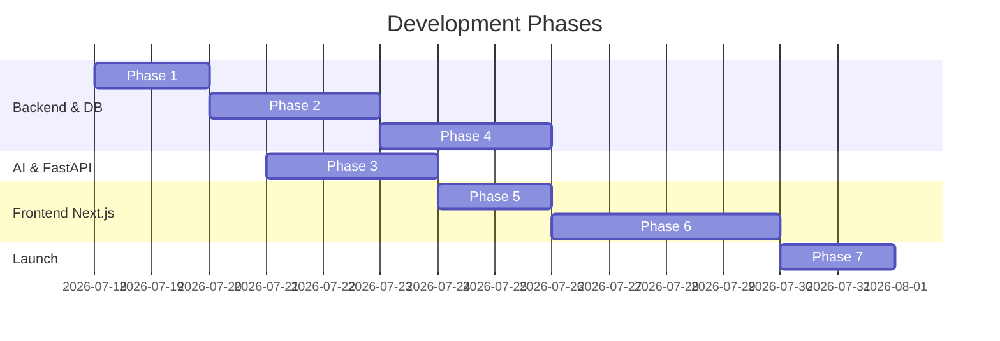

# Enterprise Predictive Maintenance Platform - Development Roadmap

This document outlines the development phase milestones for the Caterpillar Hackathon platform, mapping frontend, backend, AI microservice, and deployment tracks.

---

## Roadmap Overview

---

## Phase Detail

### Phase 1: Database Setup & JWT Authentication (Completed)
* **Goal**: Establish foundation architecture, PostgreSQL mappings, and secure role-based session credentials.
* **Tasks**:
  * [x] Schema DDL definition with indexing and partitioning strategies.
  * [x] Django project base setup and local app modularity.
  * [x] Custom User and Role models setup (enforcing 1 Manager per Site).
  * [x] SimpleJWT integration with payload custom claims for roles and email.
  * [x] Register user registration, login, logout (blacklist), and profile `/me` endpoints.
  * [x] Role seed data migration (`Super Admin`, `Site Manager`, `Maintenance Engineer`, `Service Engineer`, `Operator`).
  * [x] API test suite showing passing verification for auth and roles.

### Phase 2: Telemetry & Alert APIs (In Progress)
* **Goal**: Enable machine onboarding and ingest telemetry data.
* **Tasks**:
  * [ ] Develop Django CRUD endpoints for `Sites` and `Machines` with role restrictions (e.g., only Site Managers and Super Admins can add machines).
  * [ ] Create telemetry ingress endpoint `POST /api/telemetry/ingest/` to save high-frequency sensor readings (vibration, temperature, pressure).
  * [ ] Build a mock telemetry generator script to simulate sensor streams for Caterpillar equipment.
  * [ ] Establish validation schemas to filter noisy or corrupt sensor logs before database writing.

### Phase 3: Telemetry Anomaly ML (FastAPI Service)
* **Goal**: Create predictive models that monitor sensor feeds and forecast machine maintenance needs.
* **Tasks**:
  * [ ] Set up database connections in FastAPI using SQLAlchemy to read time-series data from `sensor_data` partitions.
  * [ ] Clean and normalize sensor data using pandas/numpy.
  * [ ] Train anomaly detection models (e.g., Isolation Forest or Autoencoders) and predictive failure classifiers (e.g., XGBoost, LSTM).
  * [ ] Implement inference endpoints `/api/predict` in FastAPI returning probability and estimated failure mode.
  * [ ] Set up model training jobs triggered asynchronously or on schedules.

### Phase 4: Maintenance Workflows & Notification Alerts
* **Goal**: Trigger notifications and alert tickets based on AI predictions, and log technician repairs.
* **Tasks**:
  * [ ] Implement an alert generation script in Django that calls the FastAPI predictive endpoints on new telemetry.
  * [ ] Auto-create `Alert` records when failure probability exceeds `0.75` or critical sensor limits are breached.
  * [ ] Set up SMS/Email trigger webhooks or email alerts for `Critical` status.
  * [ ] Implement `MaintenanceHistory` and `ServiceHistory` logging forms for engineers to record parts replaced and maintenance resolution times.

### Phase 5: Next.js Auth Shell & Client Configuration
* **Goal**: Initialize the user session shell in Next.js 15.
* **Tasks**:
  * [ ] Build state management (e.g., Zustand or React Context) for current user session.
  * [ ] Create an Axios client configuration with interceptors to automatically refresh access tokens on `401 Unauthorized` responses.
  * [ ] Build clean, styled login page and signup pages using Tailwind CSS.
  * [ ] Configure Middleware to block access to internal dashboard pages if user is not authenticated.

### Phase 6: Real-time Dashboards & Role-Based Views
* **Goal**: Build visual controls, telemetry charts, and role-based action portals.
* **Tasks**:
  * [ ] **Operator View**: Telemetry streaming logs, current machine operational status dashboard, simple quick-alert submission forms.
  * [ ] **Maintenance/Service Engineer View**: Ticket lists, maintenance task boards (Kanban-style), machine manuals, resolution forms.
  * [ ] **Site Manager / Super Admin View**: Interactive map, machinery health statistics, site cost analytics, operator log reviews, predictive health overview.
  * [ ] Embed charting library (e.g., Tremor or Recharts) for rendering time-series telemetry trends.

### Phase 7: Production Optimization & Deployment
* **Goal**: Deploy the platform for Caterpillar evaluation.
* **Tasks**:
  * [ ] Optimize Neon PostgreSQL indexes to minimize telemetry query load latency.
  * [ ] Deploy Django backend and FastAPI microservice to Railway, configuring environment variables (production secrets).
  * [ ] Deploy Next.js frontend to Vercel.
  * [ ] Conduct end-to-end integration tests to verify Next.js $\rightarrow$ Django $\rightarrow$ FastAPI $\rightarrow$ PostgreSQL flows.
